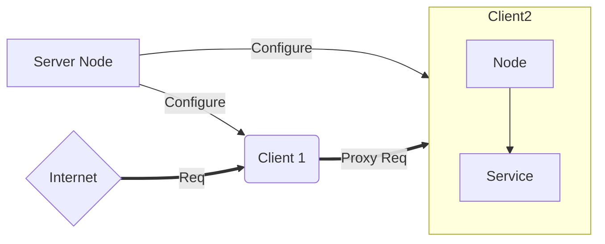

## workflow for a normal user 

1. json api called to create a domain/group 
2. json api to create the client 1, response contains a secret S1 to be used for registration 
3. json api to create the client 2, response contains a secret S2 to be used for registration 
4. client 1 started with the shared key S1
5. client 2 started with the shared key S2
6. client 1 calls server grpc api to register itself
7. client 2 calls server grpc api to register itself
8. set ingress node called for client 1 which will act as the ingress endpoint
9. tunnel api called to create a tunnel for client 1.

